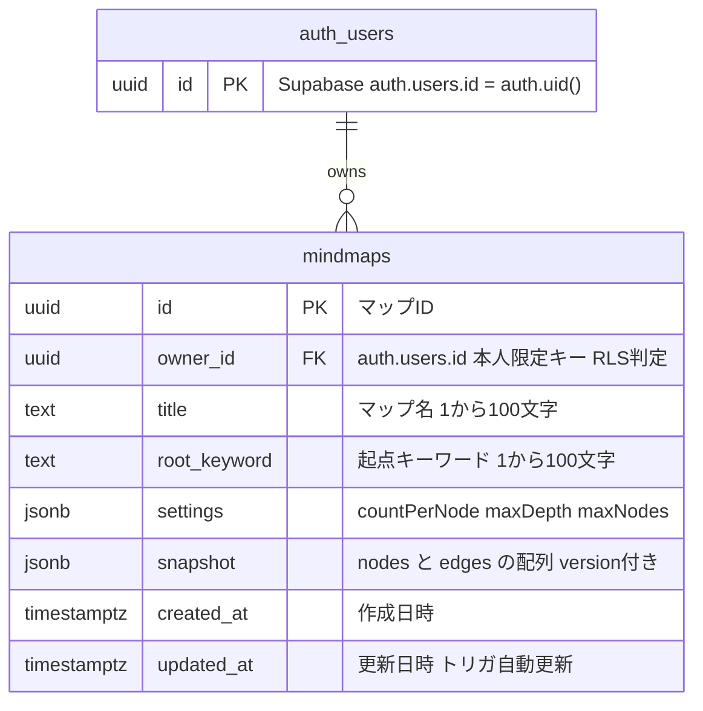
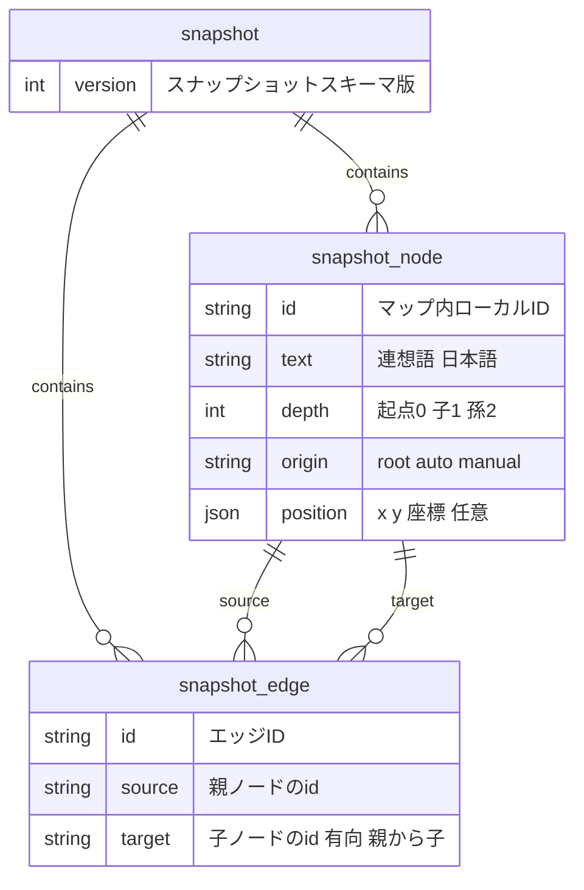

# Rensoo DB 設計書 (DATABASE)

- ステータス: ドラフト（STEP2-④ DB 設計 / 全6フェーズ）
- 最終更新: 2026-06-26
- 対象要件: docs/REQUIREMENTS.md（特に FR-18〜22 / AC-8〜11）
- 上位設計: docs/DESIGN.md（§4 概念データモデル / §3.2 MindMapRepository / §11.1 申し送り）
- 採用基盤: docs/TECH_STACK.md（Supabase(PostgreSQL) ＋ RLS / Supabase Auth(auth.uid()) / Supabase CLI マイグレーション）
- 準拠する思想: docs/philosophy/PLAN_PHILOSOPHY.md（拡張性・変動点の抽象化・過剰設計の回避）

---

## 0. この設計書の位置づけ・要否判断

### 0.1 DB 設計の要否

**永続データは必要。よって DB 設計を実施する。**

- 保存対象: 認証ユーザーが作成したマインドマップ（メタ＋ノード/エッジ＋生成設定）。
- 根拠要件: FR-19（保存は認証必須）/ FR-21（一覧・再編集・削除）/ FR-22（本人のみアクセス）/ AC-8〜11。
- 非永続: 連想生成そのもの・自走展開の途中状態・ゲスト利用中のマップは**保存しない**（フロントの Zustand 状態に留める）。
  ゲストが「保存」したときに初めて DB に書き込む。生成ジョブの進行状態は DB に持たない（DESIGN §6 インメモリ管理）。

### 0.2 本書で確定する事項（DESIGN §11.1 の申し送り）

1. 保存形（JSONB 1カラム案 vs 正規化案）の**最終決定**と理由。
2. テーブル定義（カラム・型・NULL 可否・デフォルト・制約・PK/FK・index）。
3. `settings`（生成設定）の格納形。
4. RLS ポリシー SQL（`owner_id = auth.uid()` による本人限定の CRUD）。
5. Supabase CLI マイグレーション構成。
6. ER 図（Mermaid `erDiagram`、`auth.users` との関連含む）。
7. 受け入れ条件（AC-8〜11）の充足確認。

---

## 1. 保存形の決定（JSONB 1カラム案を採用）

### 1.1 比較対象

DESIGN §4.2 / §10.1 の有力案どおり、次の2案を比較する。

- **案A: JSONB スナップショット案** — `mindmaps` を1行とし、ノード/エッジ配列を `snapshot` JSONB 1カラムに格納。
- **案B: 正規化案** — `mindmaps` / `nodes` / `edges` の3テーブルに分解し、FK で関連付ける。

### 1.2 評価

| 観点 | 案A: JSONB スナップショット | 案B: 正規化（nodes/edges テーブル） |
|---|---|---|
| 要件適合（全体保存/取得/再編集・一覧・本人限定） | ◎ マップ全体を1行で atomic に保存/取得。一覧は `mindmaps` だけで完結 | ○ 取得は JOIN（または複数クエリ）が必要。一覧は `mindmaps` だけで可 |
| 保存/取得の単純さ | ◎ 1行 upsert / 1行 select。Repository 実装が薄い | △ 保存は差分計算 or 全削除→再挿入、取得は複数テーブル集約 |
| RLS の単純さ | ◎ `mindmaps` 1テーブルにポリシーを置けば全データが保護される | △ nodes/edges にも RLS が要る（または `mindmaps` 経由の EXISTS 参照ポリシー）。ポリシーが3倍 |
| 削除整合（AC-7 孤立エッジ） | ◎ スナップショット内で完結。フロントの Zustand が整合済みの状態を保存（DESIGN §2.1） | ○ FK `ON DELETE CASCADE` で DB が担保。ただしノード単位の削除フローが要る |
| ノード単位の部分更新/検索 | △ 行全体の書き換えになる。ノード横断検索は不可 | ◎ ノード単位 update / WHERE 検索が得意 |
| 性能（数十ノード規模・NFR-2） | ◎ 数十ノード×数百バイトで JSONB 1行は軽量。N+1 が原理的に発生しない | ○ 数十行 JOIN も十分速いが、保存時の行数分の I/O が発生 |
| 拡張性（思想） | ○ ノード横断クエリ要件が出たら正規化へ移行。Repository 抽象が差を吸収（DESIGN §3.2） | ◎ 将来の共有・ノード検索・差分更新に強い |
| 実装容易性（個人開発 MVP） | ◎ 最小コードで AC を満たせる | △ マイグレーション・ポリシー・保存ロジックが増える |

### 1.3 決定: **案A（JSONB スナップショット案）を採用**

**理由（要件・思想・性能・実装容易性の総合）:**

1. **要件の中心が「マップ全体の保存・取得・再編集・一覧・本人限定」であり、ノード単位の横断検索や部分更新は MVP 要件に存在しない**（REQUIREMENTS / AC-7 の編集は保存前にフロント側で完結する）。案A の弱点（ノード単位検索/部分更新）は MVP で顕在化しない。
2. **保存/取得が atomic かつ単純**になり、`MindMapRepository`（DESIGN §3.2）の `save/get` が1行 upsert / 1行 select で実装できる。DESIGN §10.1 の「取得/保存がアトミックで RLS が MindMap 行のみで完結」と一致。
3. **RLS が1テーブルに集約**でき、認可漏れ面が最小化される（AC-11 の事故耐性が高い）。正規化案だと nodes/edges 双方にポリシーが必要で、ポリシーの抜けがそのまま漏洩になる。
4. **削除整合（AC-7）はフロントの Zustand が整合をとった状態を保存**するため（DESIGN §2.1 / §4.2）、DB 側の孤立エッジが原理的に発生しない。正規化案の `ON DELETE CASCADE` は不要になる。
5. **拡張性の担保**: 「ノード横断検索・共有・差分同期」が将来要件化した場合は、`MindMapRepository` 抽象（DESIGN §3.2）の背後で案B（正規化）へ移行できる。**物理を JSONB にすることは概念モデルの破棄ではなく物理最適化**であり、Repository がドメインと物理の差を吸収する（PLAN_PHILOSOPHY「変動点の抽象化」「過剰設計の回避」と整合、DESIGN §10.2 の留意点に準拠）。

> **思想からの逸脱の有無**: 逸脱なし。概念モデル（User/MindMap/Node/Edge）は維持し、物理だけ JSONB に畳む。これは「実際に変動が予見される箇所だけを抽象化する」方針に沿い、変動が予見されない MVP 段階で正規化の複雑さを先取りしない（過剰設計の回避）。

### 1.4 スナップショット JSONB の内部スキーマ（アプリ側 Zod で検証）

`snapshot` 列は DB では `jsonb` だが、**書き込み/読み出し時にアプリ層（API サーバー）の Zod で必ず検証**してから型付き値として扱う（CODING_PHILOSOPHY「外部入出力はスキーマ検証」）。DB の `CHECK` でも最低限の形状（後述）を守る。内部構造の正本は以下。

```jsonc
// mindmaps.snapshot（jsonb）の論理スキーマ
{
  "version": 1,                 // スナップショットスキーマのバージョン（将来のマイグレーション用）
  "nodes": [
    {
      "id": "n_root",          // マップ内一意（クライアント生成の文字列ID）
      "text": "宇宙",          // 連想語（日本語・トリム済み・非空）
      "depth": 0,               // 起点=0, 子=1, 孫=2 ...
      "origin": "root",        // "root" | "auto" | "manual"
      "position": { "x": 0, "y": 0 }  // 再レイアウト可。任意
    }
  ],
  "edges": [
    {
      "id": "e_1",
      "source": "n_root",      // 親ノードの node.id
      "target": "n_child_1"    // 子ノードの node.id（有向: 親→子）
    }
  ]
}
```

- ノード/エッジの ID は**マップ内ローカルID**（クライアント生成の文字列）。DB の行 PK（`uuid`）とは別レイヤ。
- `edges[].source` / `edges[].target` は必ず `nodes[].id` のいずれかを指す（**孤立エッジ禁止**＝AC-7）。この整合は保存前にフロントの Zustand と API サーバーの Zod が保証する。
- `version` を持たせ、将来スキーマ変更時に読み出し側でマイグレーションできる余地を残す（拡張性）。

---

## 2. スキーマ定義

### 2.1 テーブル一覧

| テーブル | 役割 | 備考 |
|---|---|---|
| `auth.users` | 認証ユーザー（Supabase Auth 管理） | **本アプリは作成しない**。Supabase が管理。所有者キーの参照先 |
| `public.mindmaps` | 保存マップ（メタ＋ snapshot JSONB） | 本アプリが定義・RLS 適用する唯一の業務テーブル |

> アプリ独自の `users`/`profiles` テーブルは**作らない**（DESIGN §4.2）。所有者は `auth.users.id`（= `auth.uid()`）を直接キーにする。プロフィール拡張が将来必要になれば `public.profiles` を別途追加する（MVP では不要＝過剰設計の回避）。

### 2.2 `public.mindmaps` テーブル

| カラム | 型 | NULL | デフォルト | 制約 / 説明 |
|---|---|---|---|---|
| `id` | `uuid` | NOT NULL | `gen_random_uuid()` | **PK**。マップの一意ID |
| `owner_id` | `uuid` | NOT NULL | （なし） | **FK → `auth.users(id)` ON DELETE CASCADE**。所有者。RLS の判定キー。ユーザー削除でマップも削除 |
| `title` | `text` | NOT NULL | `'無題のマップ'` | マップ名。`CHECK (char_length(title) BETWEEN 1 AND 100)` |
| `root_keyword` | `text` | NOT NULL | （なし） | 起点キーワード（FR-1）。`CHECK (char_length(root_keyword) BETWEEN 1 AND 100)` |
| `settings` | `jsonb` | NOT NULL | `'{"countPerNode":6,"maxDepth":3,"maxNodes":50}'::jsonb` | 生成設定（§2.4）。`CHECK` で形状検証 |
| `snapshot` | `jsonb` | NOT NULL | （なし） | ノード/エッジのスナップショット（§1.4）。`CHECK` で形状検証 |
| `created_at` | `timestamptz` | NOT NULL | `now()` | 作成日時 |
| `updated_at` | `timestamptz` | NOT NULL | `now()` | 更新日時。`BEFORE UPDATE` トリガで自動更新 |

#### 制約の詳細

- **PK**: `id`。
- **FK**: `owner_id` → `auth.users(id)`、`ON DELETE CASCADE`（ユーザー退会時に本人のマップを自動削除。データ残留・孤児行を防ぐ）。
- **CHECK（title / root_keyword）**: 長さ 1〜100 文字（NFR-7 入力検証の DB 層担保。API 側の Zod と二重化）。
- **CHECK（settings 形状）**: 後述（§2.4）。範囲はアプリ Zod が主担保、DB は最低限のキー存在＋型を守る。
- **CHECK（snapshot 形状）**: `snapshot ? 'nodes' AND snapshot ? 'edges' AND jsonb_typeof(snapshot->'nodes') = 'array' AND jsonb_typeof(snapshot->'edges') = 'array'`（最低限の形状。詳細整合は API の Zod）。

#### インデックス設計

検索パターンは「**本人のマップ一覧を更新日時の新しい順に並べる**」（FR-21 / AC-10）と「**id 指定での単一取得**」（AC-10）の2つに集約される。

| index | 対象 | 目的 | 根拠 |
|---|---|---|---|
| PK（自動） | `(id)` | 単一取得 `WHERE id = ?` | AC-10（開く） |
| `idx_mindmaps_owner_updated` | `(owner_id, updated_at DESC)` | 一覧取得 `WHERE owner_id = ? ORDER BY updated_at DESC` | FR-21 / AC-10（一覧を新しい順） |

- `owner_id` 単独の index は `(owner_id, updated_at DESC)` が前方カバーするため**不要**（重複 index を避け、書き込みコストを抑える）。
- `snapshot` / `settings`（JSONB）への **GIN index は MVP では作らない**。ノード横断検索要件が無く、書き込みコストとサイズ増に見合わないため（過剰インデックスの回避）。将来ノード内検索が必要になった時点で追加する。

### 2.3 DDL（マイグレーション本体・抜粋）

```sql
-- 拡張: gen_random_uuid() は pgcrypto（Supabase は既定で利用可）
create extension if not exists pgcrypto;

create table public.mindmaps (
  id           uuid        primary key default gen_random_uuid(),
  owner_id     uuid        not null references auth.users (id) on delete cascade,
  title        text        not null default '無題のマップ'
                           check (char_length(title) between 1 and 100),
  root_keyword text        not null
                           check (char_length(root_keyword) between 1 and 100),
  settings     jsonb       not null
                           default '{"countPerNode":6,"maxDepth":3,"maxNodes":50}'::jsonb
                           check (
                             jsonb_typeof(settings->'countPerNode') = 'number'
                             and jsonb_typeof(settings->'maxDepth')   = 'number'
                             and jsonb_typeof(settings->'maxNodes')   = 'number'
                           ),
  snapshot     jsonb       not null
                           check (
                             snapshot ? 'nodes' and snapshot ? 'edges'
                             and jsonb_typeof(snapshot->'nodes') = 'array'
                             and jsonb_typeof(snapshot->'edges') = 'array'
                           ),
  created_at   timestamptz not null default now(),
  updated_at   timestamptz not null default now()
);

create index idx_mindmaps_owner_updated
  on public.mindmaps (owner_id, updated_at desc);

-- updated_at 自動更新トリガ
create or replace function public.set_updated_at()
returns trigger
language plpgsql
as $$
begin
  new.updated_at = now();
  return new;
end;
$$;

create trigger trg_mindmaps_updated_at
  before update on public.mindmaps
  for each row execute function public.set_updated_at();
```

> `owner_id` の DEFAULT に `auth.uid()` を設定する手もあるが、本アプリは API サーバーが INSERT 時に明示セットするため DEFAULT は付けない（明示性を優先）。RLS の `with check` で `owner_id = auth.uid()` を強制するため、他人を owner にした INSERT は弾かれる（§3）。

### 2.4 `settings`（生成設定）の格納形

DESIGN §5.5 `generationSettingsSchema` / §6.1 の確定既定値に一致させる。**独立カラムに展開せず JSONB 1カラム**に格納する。

```jsonc
// mindmaps.settings（jsonb）
{
  "countPerNode": 6,   // 1ノード生成件数: 既定6 / 範囲3〜10（FR-4）
  "maxDepth": 3,       // 最大深さ: 既定3 / 範囲1〜5（FR-13）
  "maxNodes": 50       // 総ノード上限: 既定50 / 範囲2〜100（FR-13）
}
```

- **JSONB を選ぶ理由**: 生成設定は「マップ生成時のパラメータの記録」であり、DB での個別検索・集計・ソート対象にしない。将来パラメータが増減しても**マイグレーション不要**で追従できる（拡張性）。範囲検証（3〜10 等）の主担保はアプリ層の Zod（DESIGN §5.5）で、DB の CHECK はキー存在＋数値型のみを守る（DB を厳密範囲チェックの正本にしない＝設定変更時の二重メンテを避ける）。
- 列に展開しない判断は「検索キーにならない属性は JSONB に畳む」原則に沿う（過剰正規化の回避）。

---

## 3. RLS（Row Level Security）ポリシー

### 3.1 方針（AC-9 / AC-11 の DB 層担保）

- `public.mindmaps` で **RLS を有効化**し、**本人（`owner_id = auth.uid()`）の行のみ** select / insert / update / delete を許可する。
- **匿名（ゲスト）ユーザーは `auth.uid()` が NULL** になるため、いずれのポリシーにもマッチせず**保存系に一切アクセスできない**（AC-9: ゲストは保存不可、AC-8: ゲストは生成・閲覧のみで保存系 DB に触れない）。
- API サーバーは**ユーザー JWT を引き継いだ Supabase クライアント**でクエリを発行する（DESIGN §7.3）。`service_role`（RLS バイパス）は保存系で**使わない**。
- 認可は **API サーバーの JWT 検証（1段目）＋ DB の RLS（最後の砦）** で二重化（DESIGN §7.3）。

### 3.2 ポリシー SQL

```sql
-- RLS 有効化（有効化しただけでは全拒否。下のポリシーで本人のみ許可）
alter table public.mindmaps enable row level security;

-- SELECT: 本人の行のみ閲覧可（一覧・取得） — AC-10, AC-11
create policy mindmaps_select_own
  on public.mindmaps
  for select
  to authenticated
  using (owner_id = (select auth.uid()));

-- INSERT: owner を自分にした行のみ作成可（他人を owner にした保存を拒否） — AC-9, AC-10
create policy mindmaps_insert_own
  on public.mindmaps
  for insert
  to authenticated
  with check (owner_id = (select auth.uid()));

-- UPDATE: 本人の行のみ更新可。更新後も owner を自分以外に書き換え不可 — AC-10, AC-11
create policy mindmaps_update_own
  on public.mindmaps
  for update
  to authenticated
  using (owner_id = (select auth.uid()))
  with check (owner_id = (select auth.uid()));

-- DELETE: 本人の行のみ削除可 — AC-10, AC-11
create policy mindmaps_delete_own
  on public.mindmaps
  for delete
  to authenticated
  using (owner_id = (select auth.uid()));
```

### 3.3 ポリシー設計の要点

- **`to authenticated` の指定**: ポリシーの対象ロールを認証済みユーザーに限定する。`anon`（匿名）ロールにはどのポリシーも付与しないため、**ゲストは select/insert/update/delete のいずれも不可**（AC-8/AC-9 を DB で強制）。
- **`(select auth.uid())` で包む**: `auth.uid()` をサブクエリ化すると PostgreSQL が**行ごとではなく1回だけ評価**し、一覧取得（多数行）のパフォーマンスが向上する（Supabase 公式の RLS 最適化パターン）。
- **`using` と `with check` の使い分け**:
  - `using`（読み取り対象行のフィルタ）: select/update/delete で「本人の行か」を判定。
  - `with check`（書き込む値の検証）: insert/update で「書き込む `owner_id` が自分か」を検証。他人を owner にしたなりすまし INSERT、owner の付け替え UPDATE を拒否する。
- **他人のマップ取得は 0 件化**: 他人の `id` を直接指定して GET しても `using` で 0 行になり、API は 404 を返す（DESIGN §5.4: FORBIDDEN は通常 404 に倒す）。情報漏洩しない（AC-11）。
- **`service_role` の扱い**: 管理用途のみ。保存系では使わない（使うと RLS をバイパスし全行に触れてしまうため＝DESIGN §7.3 / TECH_STACK §2.9）。

---

## 4. Supabase CLI マイグレーション構成

### 4.1 ディレクトリ構成

```
supabase/
├── config.toml                         # Supabase プロジェクト設定（supabase init で生成）
└── migrations/
    ├── 20260626090000_create_mindmaps.sql   # テーブル・index・updated_at トリガ
    └── 20260626090100_mindmaps_rls.sql      # RLS 有効化・4ポリシー
```

- マイグレーションファイルは**タイムスタンプ接頭辞**で順序を保証（`supabase migration new <name>` が生成）。
- **テーブル定義（§2.3）と RLS（§3.2）はファイルを分ける**: スキーマ変更と認可ポリシー変更を独立にレビュー/差し戻しできるようにする（変更の関心を分離）。
- すべて**前方追記**で運用（既存マイグレーションは編集しない）。スキーマ変更は新規ファイルを追加する。

### 4.2 運用フロー

```bash
# 初期化（初回のみ）
supabase init

# マイグレーション雛形を作成
supabase migration new create_mindmaps
supabase migration new mindmaps_rls

# ローカル DB（Docker）に適用して検証
supabase start
supabase db reset            # migrations を頭から再適用（再現性チェック）

# リモート（本番/ステージング）へ反映
supabase db push
```

- **再現性**: スキーマ・RLS はすべて SQL でコード化し、`supabase db reset` で頭から再構築できる状態を保つ（TECH_STACK §2.9）。
- **RLS 検証**: マイグレーション後、`authenticated`（別ユーザー2人）で「自分のマップは見える / 他人のマップは見えない」を統合テストで確認（AC-11 の回帰防止）。
- `.env` / プロジェクトキーはコミットしない（CLAUDE.md / GIT_CONVENTIONS）。

---

## 5. ER 図（Mermaid `erDiagram`）

`auth.users`（Supabase 管理）と `public.mindmaps`（本アプリ定義）の関連を示す。Node/Edge は `mindmaps.snapshot`（JSONB）内の論理構造であり物理テーブルではないため、参考として論理構造ブロックを併記する。



### 5.1 snapshot JSONB の論理構造（物理テーブルではない・参考）

`snapshot` 内の Node / Edge は概念モデル（DESIGN §4.1）に対応するが、案A 採用により**物理テーブルには展開しない**。論理的な関連は以下。



> 物理は `mindmaps.snapshot jsonb` に畳まれる。将来ノード横断検索/共有が要件化したら、この論理構造をそのまま `nodes` / `edges` テーブルへ正規化展開できる（`MindMapRepository` 抽象が吸収）。

---

## 6. 受け入れ条件（AC-8〜11）の充足確認

| AC | 内容 | スキーマ＋RLS での充足 |
|---|---|---|
| **AC-8** | ゲストで生成〜マップ操作が一通り行える | ゲスト利用中のマップは **DB に書き込まない**（フロント Zustand 保持）。`mindmaps` への RLS は `authenticated` 限定で、ゲスト操作は DB に依存しない。生成系は DB 非関与（DESIGN §7.1） |
| **AC-9** | ゲストが「保存」するとログイン要求・未ログインでは保存されない | 匿名は `auth.uid()` が NULL で `insert` ポリシー（`to authenticated` / `with check owner_id = auth.uid()`）にマッチせず**保存不可**。API 側も保存系は JWT 必須で 401（DESIGN §5.2 / §7.2） |
| **AC-10** | 保存でき、再ログイン後に一覧から開いて再編集・削除できる | 保存=`insert/update`（本人）、一覧=`select` ＋ `idx_mindmaps_owner_updated` で更新日時順、開く=`select WHERE id`、再編集=`update`、削除=`delete`。すべて本人ポリシーで許可。`updated_at` トリガで最新順を維持 |
| **AC-11** | 他ユーザーの保存マップにアクセスできない | 全ポリシーが `owner_id = (select auth.uid())` 条件。他人の `id` 指定でも `using` で 0 行＝404。`select/update/delete` すべてで他人の行に到達不能。`service_role` 不使用で RLS をバイパスしない |

### 6.1 削除整合（AC-7 関連）の方針

- **マップ内のノード/エッジ削除（AC-7）**: 案A では `snapshot` 内で完結。フロントの Zustand がノード削除時に**孤立エッジを除去した整合済み snapshot**を作り、それを保存する（DESIGN §2.1 / §4.2）。API サーバーは保存前に Zod で「全 edge の source/target が node に存在する」ことを検証する。**DB 側の FK/CASCADE は不要**（ノード/エッジが物理行でないため）。
- **マップ自体の削除**: `delete` ポリシーで本人のみ。1行削除で snapshot ごと消えるため孤児行は発生しない。
- **ユーザー削除時**: `owner_id` の `ON DELETE CASCADE` で当該ユーザーの全マップが自動削除され、孤児マップが残らない。

---

## 7. 想定クエリと Repository マッピング

`MindMapRepository`（DESIGN §3.2）の各メソッドが、本スキーマでどのクエリになるかを示す（すべてユーザー JWT 引き継ぎ＝RLS 有効下）。

| メソッド | クエリ概形 | 効くポリシー / index |
|---|---|---|
| `list(userId)` | `select id, title, updated_at from mindmaps order by updated_at desc` | `mindmaps_select_own` / `idx_mindmaps_owner_updated` |
| `get(userId, mapId)` | `select * from mindmaps where id = $1` | `mindmaps_select_own` / PK |
| `save(新規)` | `insert into mindmaps (owner_id, title, root_keyword, settings, snapshot) values (...) returning ...` | `mindmaps_insert_own` |
| `save(上書き)` | `update mindmaps set title=, root_keyword=, settings=, snapshot= where id = $1 returning ...` | `mindmaps_update_own` / PK |
| `remove(userId, mapId)` | `delete from mindmaps where id = $1` | `mindmaps_delete_own` / PK |

- `list` / `get` / `update` / `delete` の `WHERE` に `owner_id = auth.uid()` を**明示しなくても RLS が自動付与**するが、API 側でも `owner_id` 条件を明示して二重化してよい（DESIGN §7.3 アプリ層チェック）。
- `save` の新規/上書き分岐は、リクエストに `id` があれば update、なければ insert（DESIGN §5.3）。

---

## 8. 思想・要件トレーサビリティ（まとめ）

| 項目 | 準拠 |
|---|---|
| 拡張性（PLAN_PHILOSOPHY） | JSONB に `version` を持たせ将来移行可。Repository 抽象が物理差を吸収。正規化への退避路を確保 |
| 過剰設計の回避 | MVP に不要な正規化/GIN index/profiles テーブルを作らない。検索キーにならない設定は JSONB に畳む |
| 整合性を型・制約で守る | NOT NULL・FK・CHECK（長さ/形状）・RLS で DB 層を堅く。API の Zod と二重化 |
| 認可は DB で最後の砦（CODING_PHILOSOPHY） | RLS `owner_id = auth.uid()` を全 CRUD に。`service_role` 不使用 |
| 削除整合（AC-7 / FR-17） | snapshot 内整合（フロント＋Zod）＋ ユーザー削除 CASCADE |
| 入力検証（NFR-7） | title/root_keyword 長さ CHECK、settings/snapshot 形状 CHECK |

---

## 9. 未決・将来拡張（MVP 対象外）

- **ノード横断検索 / 共有リンク / 差分同期**が要件化した場合: `snapshot` を `nodes` / `edges` テーブルへ正規化展開（FK `ON DELETE CASCADE`、nodes/edges への RLS は `mindmaps` 経由 EXISTS 参照）。Repository 抽象の背後で移行。
- **プロフィール拡張**（表示名・アバター等）: `public.profiles(id uuid references auth.users primary key, ...)` を別途追加。
- **マップ数の制限 / 監査ログ**: 必要になれば CHECK・別テーブルで対応。
- **snapshot サイズ上限**: 総ノード上限 50（DESIGN §6.1）により実質数十 KB に収まる。明示的な行サイズ制約は MVP では設けない（TOAST で十分）。

---

## 付録: 関連ドキュメント

- 要件: docs/REQUIREMENTS.md
- アーキテクチャ設計: docs/DESIGN.md
- 技術選定: docs/TECH_STACK.md
- 設計思想: docs/philosophy/PLAN_PHILOSOPHY.md
- 実装思想: docs/philosophy/CODING_PHILOSOPHY.md
