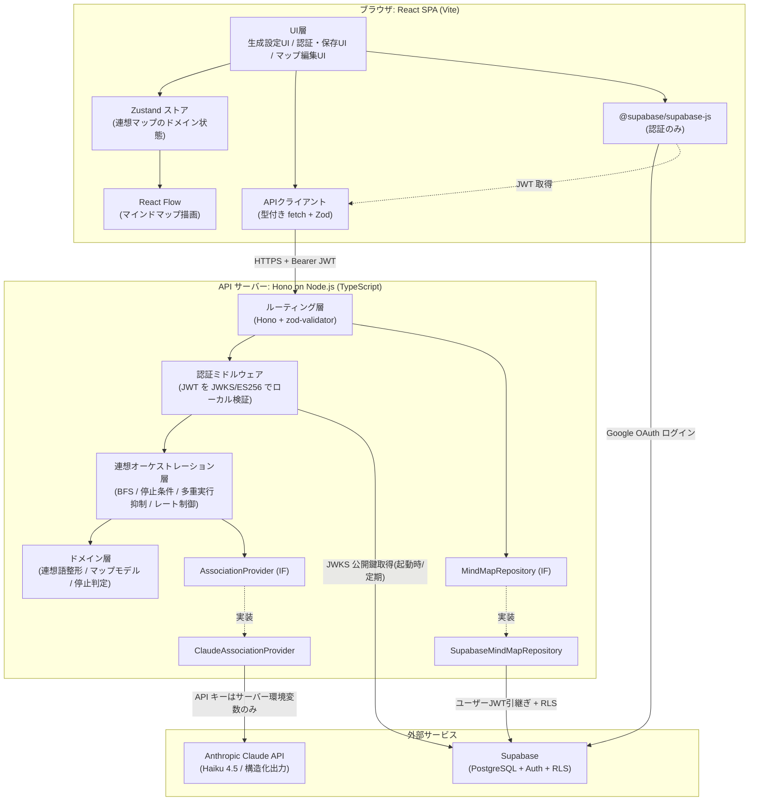
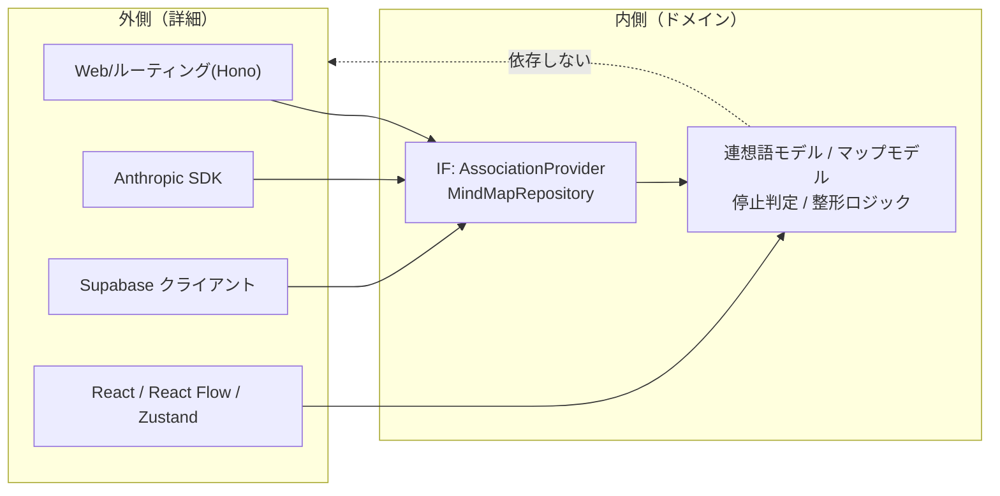
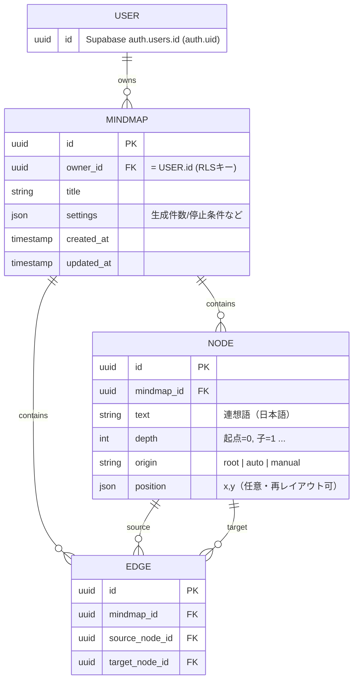
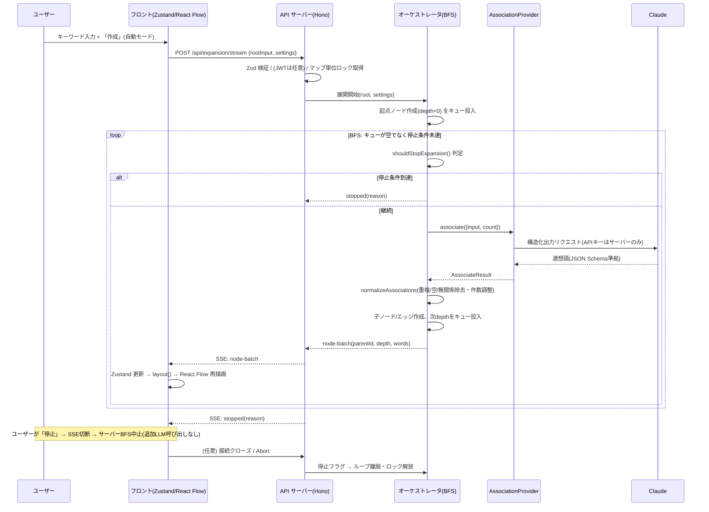
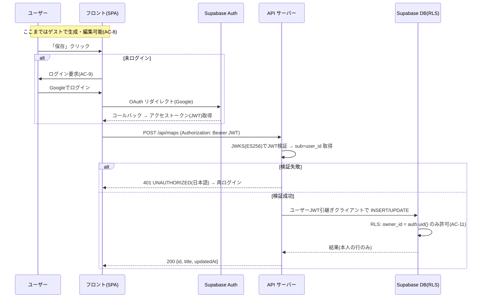

# Rensoo アーキテクチャ設計書 (DESIGN)

- ステータス: ドラフト（STEP2 設計 / 全6フェーズ）
- 最終更新: 2026-06-26
- 対象要件: docs/REQUIREMENTS.md（FR / NFR / AC-1〜13）
- 実現可能性の前提: docs/FEASIBILITY.md
- 採用技術: docs/TECH_STACK.md（本書はこれを覆さない）
- 準拠する思想: docs/philosophy/PLAN_PHILOSOPHY.md / CODING_PHILOSOPHY.md / TEST_PHILOSOPHY.md
- 次フェーズ: STEP2-④ DB 設計（docs/DATABASE.md）／ディレクトリ構造（docs/DIRECTORY_STRUCTURE.md）

---

## 0. この設計書の位置づけ

本書は「アーキテクチャ（構造）」を確定する。詳細なテーブル定義・カラム型・RLS ポリシー SQL は
`docs/DATABASE.md` に委ねる。本書では**概念データモデルと主要 API/IF、自走展開の制御フロー、
拡張点のインターフェース**までを確定し、思想（特に PLAN_PHILOSOPHY）との整合を示す。

設計の柱（思想からの導出）:

1. **境界の分離**: 連想生成（API サーバー）／状態・描画（フロント）／永続化（Supabase）／認証（Supabase Auth）を疎結合に保つ。
2. **変動点の抽象化**: `AssociationProvider`（連想ソース）／`MindMapRepository`（永続化）／`layout()`（描画レイアウト）の3つだけを拡張点にする。
3. **依存方向は内向き**: ドメイン（連想・マップ・停止条件）はフレームワーク・SDK・DB に依存しない。外側がドメインに依存する。
4. **コスト/暴走をアーキで制御**: 自走展開の停止条件・多重実行抑制・レート制御は API サーバーのオーケストレーション層の責務に集約する。

---

## 1. アーキテクチャ概要

### 1.1 全体構成図



### 1.2 データと制御の流れ（要約）

- **連想生成（ゲスト可）**: ブラウザ → API サーバー（JWT 任意）→ `AssociationProvider`（Claude）→ 連想語配列 → ドメインで整形（重複/空/無関係除去・件数調整）→ フロントへ返却 → Zustand に反映 → React Flow が描画。
- **自走展開（自動連鎖, ゲスト可）**: API サーバーのオーケストレータが BFS で展開対象ノードをキュー処理し、各展開で `AssociationProvider` を呼ぶ。停止条件（深さ・総ノード上限）をキュー投入前に判定。SSE で段階的に結果をフロントへ送る。
- **保存系（要認証）**: ブラウザが Supabase Auth で取得した JWT を Bearer 付与 → API サーバーが JWKS でローカル検証 → ユーザー JWT を引き継いだ Supabase クライアント経由で RLS を効かせて本人の行のみ操作。
- **シークレット**: Anthropic API キーは API サーバーの環境変数のみ。フロントには一切露出しない（NFR-5 / AC-13）。

### 1.3 レイヤと依存方向（内向き依存）



ドメイン層（純粋 TS）は Hono・Anthropic SDK・Supabase・React に依存しない。
インターフェース（`AssociationProvider` / `MindMapRepository`）はドメイン側に定義し、外側がそれを実装する（依存性逆転）。

---

## 2. コンポーネント分割と責務

### 2.1 フロントエンド（React SPA）

| コンポーネント | 責務 | 主な依存 | 依存方向の注意 |
|---|---|---|---|
| **マップ編集 UI** | キーワード入力・「作成」ボタン・自動/手動トグル・停止/一時停止操作・ノード編集 UI（追加/編集/削除） | Zustand ストア、APIクライアント | ドメイン操作はストアに委譲。UI はロジックを持たない |
| **マインドマップ描画（React Flow）** | ノード/エッジの描画、ズーム/パン、ノードクリック検知、自動レイアウト適用 | Zustand ストア、`layout()` | ドメイン状態はストアから供給。描画ライブラリにドメイン状態を握らせない |
| **連想マップ状態ストア（Zustand）** | ノード/エッジ/生成設定/モード/展開ジョブ進行状態の保持と、追加・編集・削除のエッジ整合ロジック | （UI 非依存のプレーン TS） | **ここがフロントのドメイン中核**。モックなしでユニットテスト可能にする |
| **生成設定 UI** | 1ノード生成件数（既定6/範囲3〜10）、停止条件（深さ・総ノード上限）の調整 | Zustand ストア | 設定値は型＋Zodで範囲検証 |
| **認証・保存 UI** | Google OAuth ログイン導線、保存/一覧/開く/削除、ゲスト保存時のログイン要求 | `@supabase/supabase-js`（認証）、APIクライアント | 保存操作前に未ログインを検知してログイン要求（AC-9） |
| **APIクライアント** | API サーバーへの型付き fetch、リクエスト/レスポンスの Zod 検証、SSE 受信、エラー→日本語メッセージ変換、再試行 | Zod スキーマ（共有）、TanStack Query（任意） | 外部 I/O は必ず Zod 検証してから型付き値に（CODING_PHILOSOPHY） |

> **React Flow と Zustand の分離（思想の要）**: React Flow 内蔵の `useNodesState/useEdgesState` にドメイン状態を握らせず、
> ドメイン状態は Zustand に置き、React Flow へはそこから供給する。これにより「ロジックの UI 非依存」と
> 「描画ライブラリ差し替え余地」を確保する（PLAN_PHILOSOPHY）。

#### 2.1.1 画面／ルーティング構成（M6・T18 で導入）

MVP は「全画面キャンバスに操作 UI を重ねる単一画面」だったが、M6（UI 大規模改修）で **2 画面構成**へ再編する。
ルーティングは `react-router-dom` で定義し、ドメイン状態（Zustand ストア）は画面をまたいで共有されるため、
ホームで開始した生成は編集画面へ遷移しても継続する。

| ルート | 画面 | 責務 | 対応タスク |
|---|---|---|---|
| `/` | **ホーム画面**（`pages/HomePage.tsx`） | ヘッダー（ロゴ・ログイン・テーマ切替）／ヒーロー（キーワード入力＋「作成」）／**未ログイン=機能紹介**・**ログイン=保存マップ一覧（開く/削除）**。「作成」で `/map` へ遷移し生成開始 | T18, T19 |
| `/map` | **マインドマップ編集画面**（`pages/EditorPage.tsx`） | サイドバー（ノードツリー・ノード数）／放射状キャンバス（描画・ズーム・生成中ロック・完了時 fitView）／トップバー（起点ラベル・生成中インジケータ・再生成）／ノード編集 | T18, T20, T21, T22 |

- **共通ヘッダー**（`components/layout/AppHeader.tsx`）: ロゴ「MindWeave」・ログインボタン・テーマ切替を両画面で共有する。
- **テーマ**: ダーク（既定）／ライトを `<html>` の `.dark` クラスで切り替える（`app/useTheme.ts`・localStorage 永続化）。
  配色は `src/index.css` のデザイントークン（両モード）に集約し、コンポーネントはトークン経由でのみ参照する。
- **状態共有**: 生成フロー（`createAssociationMap`/`startExpansion`）はストアを直接操作するため、ホーム→編集の遷移後も
  進行状態・ノード/エッジがそのまま引き継がれる（画面はストアの購読者にすぎない）。

### 2.2 API サーバー（Hono on Node.js）

| コンポーネント | 責務 | 依存方向の注意 |
|---|---|---|
| **ルーティング層（Hono + @hono/zod-validator）** | エンドポイント定義、リクエスト/レスポンスの Zod 検証、SSE ストリーミング、エラー応答の整形 | Hono への依存はこの層に閉じ込める。ドメインは Hono を知らない |
| **認証ミドルウェア** | `Authorization: Bearer <JWT>` を Supabase JWKS（ES256）でローカル検証、`sub`(user_id) 抽出。**生成系=任意 / 保存系=必須** | 検証ロジックは独立。JWKS 公開鍵は起動時取得＋定期更新でキャッシュ |
| **連想オーケストレーション層** | 自走展開 BFS、停止条件判定、多重実行抑制（マップ/ノード単位ロック）、レート制御（並列度制限＋指数バックオフ）、SSE での段階送信 | `AssociationProvider` **インターフェースにのみ依存**。Claude 実装を直接知らない |
| **ドメイン層** | 連想語の整形（重複/空/無関係/件数調整）、マップ/ノード/エッジのモデル、停止判定の純粋関数 | フレームワーク・SDK 非依存。モックなしでテスト可能 |
| **AssociationProvider 実装（ClaudeAssociationProvider）** | 入力語→連想語リスト。Anthropic SDK 呼び出し、構造化出力スキーマ指定、API キー秘匿 | インターフェースの一実装。差し替え可能 |
| **MindMapRepository 実装（SupabaseMindMapRepository）** | マップの保存/一覧/取得/削除。ユーザー JWT 引き継ぎで RLS 経由アクセス | インターフェースの一実装。Supabase を隠蔽 |
| **保存系エンドポイント** | 認証必須でマップ CRUD を提供。Repository を介して永続化 | 認可は JWT 検証＋ DB の RLS で二重担保 |

### 2.3 依存ルール（強制したい不変条件）

- ドメイン層は `hono` / `@anthropic-ai/sdk` / `@supabase/supabase-js` を import しない（ESLint の import 制限ルールで強制を検討）。
- オーケストレーション層は `AssociationProvider` / `MindMapRepository` のインターフェースにのみ依存し、具体実装に依存しない（DI でコンストラクタ注入）。
- UI 層はドメイン状態の更新ロジックを持たず、Zustand のアクション経由でのみ状態を変更する。

---

## 3. 拡張点（PLAN_PHILOSOPHY の中核）

「実際に変動が予見される箇所」だけを抽象化する。MVP で設ける拡張点は**3つに限定**する（過剰設計の回避）。

### 3.1 AssociationProvider（連想ソースの抽象）— 最重要

連想語生成を「入力語→連想語リスト」のインターフェース背後に隠す。Claude / OpenAI / Gemini / 将来の辞書API を差し替え可能にする。

```typescript
// ドメイン側に定義（外側がこれを実装する＝依存性逆転）

/** 1件の連想語（整形済みドメイン値） */
export interface AssociationWord {
  readonly word: string;        // 表示テキスト（日本語・トリム済み・非空）
}

/** 連想生成の要求 */
export interface AssociateRequest {
  readonly input: string;       // 起点となる語
  readonly count: number;       // 希望生成件数（3〜10、既定6）
  readonly locale: 'ja';        // MVP は日本語固定（将来の多言語拡張点）
}

/** 連想生成の結果（整形前のプロバイダ生出力に近い段階） */
export interface AssociateResult {
  readonly words: readonly AssociationWord[];
  readonly meta?: {
    readonly provider: string;  // 'claude' 等（ロギング/可観測性用）
    readonly model?: string;
  };
}

/** 連想ソースの抽象。実装: ClaudeAssociationProvider など */
export interface AssociationProvider {
  /**
   * 入力語から連想語リストを生成する。
   * - プロバイダ呼び出しの失敗は AssociationProviderError として throw（握りつぶさない）。
   * - 件数の厳密一致は保証しない（構造化出力は配列長の数値制約非対応のため）。
   *   件数調整・重複/空/無関係除去はドメインの整形ロジックが担う。
   */
  associate(req: AssociateRequest): Promise<AssociateResult>;
}

/** プロバイダ起因の失敗を表す型付きエラー（呼び出し側で再試行/分類できる） */
export class AssociationProviderError extends Error {
  constructor(
    message: string,
    readonly kind: 'rate_limit' | 'timeout' | 'invalid_response' | 'upstream' | 'unknown',
    readonly retryable: boolean,
    options?: { cause?: unknown },
  ) {
    super(message, options);
    this.name = 'AssociationProviderError';
  }
}
```

整形ロジック（ドメインの純粋関数。プロバイダ非依存・モックなしでテスト可能）:

```typescript
/**
 * プロバイダ生出力を「重複/空/無関係を除去し、件数に合わせて整形」する。
 * - 入力語自身・空白・重複を除去（FR-5）
 * - count を超えたらトリム、不足は許容（不足時の再生成はオーケストレータ判断）
 * 戻り値は整形済みの確定連想語リスト。
 */
export function normalizeAssociations(
  raw: readonly AssociationWord[],
  params: { input: string; count: number },
): readonly AssociationWord[];
```

### 3.2 MindMapRepository（永続化の抽象）

保存先（Supabase）を抽象化し、ストレージ実装の変更がドメインに波及しないようにする。

```typescript
export interface MindMapSummary {
  readonly id: string;
  readonly title: string;
  readonly updatedAt: string;   // ISO8601
}

/** 保存されるマップの実体（ノード/エッジを含む。詳細構造は DATABASE.md で確定） */
export interface MindMapSnapshot {
  readonly id: string;
  readonly title: string;
  readonly nodes: readonly MindMapNode[];
  readonly edges: readonly MindMapEdge[];
  readonly settings: GenerationSettings;
}

/** 永続化の抽象。認可（本人限定）は実装＋DBのRLSで担保する。 */
export interface MindMapRepository {
  /** 認証ユーザーのマップ一覧（本人のもののみ） */
  list(userId: string): Promise<readonly MindMapSummary[]>;
  /** 1件取得（他人のものは取得不可。なければ null） */
  get(userId: string, mapId: string): Promise<MindMapSnapshot | null>;
  /** 新規作成 or 上書き保存（本人のもののみ） */
  save(userId: string, snapshot: MindMapSnapshot): Promise<MindMapSummary>;
  /** 削除（本人のもののみ、関連ノード/エッジも整合的に） */
  remove(userId: string, mapId: string): Promise<void>;
}
```

> userId を引数で受け取るが、**真の認可境界は DB の RLS（auth.uid()）**。Repository 実装はユーザー JWT を
> 引き継いだ Supabase クライアントで発行し、アプリ層チェックと DB 層強制を二重化する（CODING_PHILOSOPHY）。

### 3.3 layout()（描画レイアウトの抽象）

自動レイアウトを関数境界で抽象化し、Dagre↔ELK を差し替え可能にする（Dagre のメンテ非活発リスクの吸収）。

```typescript
export interface LayoutInput {
  readonly nodes: readonly MindMapNode[];
  readonly edges: readonly MindMapEdge[];
  readonly direction?: 'TB' | 'LR';
}
export interface PositionedNode {
  readonly id: string;
  readonly position: { x: number; y: number };
}
/** 実装: dagreLayout / radialLayout / elkLayout。フロント側の純粋関数として差し替え可能。 */
export type LayoutFn = (input: LayoutInput) => readonly PositionedNode[];
```

**実装（M6 で第2実装を追加）**:

| 実装 | 特徴 | 座標系 | 位置づけ |
|---|---|---|---|
| `dagreLayout`（第一） | 階層（ツリー）配置。TB/LR 対応 | 左上原点 | 汎用・注入可能な代替 |
| `radialLayout`（第二・**既定**） | 起点を中心に子を同心円状へ再帰配置（MindWeave デザインの放射状マップ） | **中心原点**（React Flow は `nodeOrigin=[0.5,0.5]` で各ノード中心を合わせる） | M6 の既定レイアウト |

> `layout()` 抽象があるため、放射状レイアウトの追加は `apps/web/src/mindmap-layout/radialLayout.ts` を1ファイル足し、
> `MindMapCanvas` の既定供給関数を差し替えるだけで完結した（Dagre 実装・ドメイン・ストアは無改変）。拡張点の設計どおり。

**完了時 fitView（M6・T22）**: 生成が終わった瞬間（store `status` が `generating`→`idle`）だけ React Flow の `fitView` で
全体が収まるようズームを自動調整する（`shouldFitViewOnStatusChange` 純粋関数で判定・`FitViewController`）。段階描画の
毎バッチや失敗（error）では発火させず、以後の手動ズーム/パンは尊重する（無限追従しない）。右下のズーム UI（`ZoomControls`：
拡大/縮小/倍率/全体表示）も同 API（`useReactFlow`）で提供する。

### 3.4 拡張点を「あえて設けない」もの（過剰設計の回避）

- **外部ジョブキュー（BullMQ/Redis）**: 1マップ最大10コール程度（FEASIBILITY）。インメモリのキュー＋ロックで足り、将来スケール時に差し替える（今は抽象化しない）。
- **マルチプロバイダ既製抽象（Vercel AI SDK 等）**: 連想生成は狭く明確な1インターフェースで足りる。自前の薄い `AssociationProvider` の方が依存が少ない。
- **認証プロバイダの抽象**: Supabase Auth は確定制約。OAuth プロバイダ追加（GitHub 等）は Supabase コンソール設定で済み、コード抽象は不要。

---

## 4. 概念データモデル

詳細スキーマ（型・制約・RLS・正規化 vs JSON 1カラムの確定）は `docs/DATABASE.md` で行う。ここでは概念レベル。

### 4.1 概念 ER 図



### 4.2 エンティティと関連・カーディナリティ

| エンティティ | 説明 | 主な属性（概念） |
|---|---|---|
| **User** | 認証ユーザー。Supabase `auth.users` が実体。アプリ独自テーブルは持たず `auth.uid()` を所有者キーに使う | id（= auth.uid） |
| **MindMap** | 1つの連想マップ。保存単位。所有者は1人 | id, owner_id, title, settings（生成件数・停止条件）, created_at, updated_at |
| **Node（連想語）** | マップ上の1ノード。起点ノードと連想語ノードを区別（origin） | id, mindmap_id, text, depth, origin(root/auto/manual), position |
| **Edge** | 親→子の連想関係 | id, mindmap_id, source_node_id, target_node_id |

カーディナリティ:

- User 1 — 0..N MindMap（ゲストは User を持たず、保存しない＝0件）。
- MindMap 1 — 1..N Node（起点ノードを必ず含む）、1 — 0..N Edge。
- Node 1 — 0..N Edge（source / target いずれの側にも立つ）。エッジは「親ノード→子ノード」の有向。

設計判断（DATABASE.md で最終確定）:

- **正規化 vs JSON 1カラム**: MVP は「数十ノード規模・保存/取得が中心・ノード単位の部分更新は少ない」ため、
  **MindMap を1行、ノード/エッジを `snapshot` JSON 1カラムで保存する案**が有力（取得/保存がアトミックで単純、RLS も MindMap 行のみで完結）。
  ノード単位のクエリ要件（検索・共有）が将来出たら正規化へ移行できるよう、Repository 抽象で吸収する。最終判断は DATABASE.md。
- **削除整合**: ノード削除時に孤立エッジを残さない（AC-7）。JSON 1カラム案ならフロントのストアで整合をとってから保存するため DB 制約は不要。正規化案なら FK の ON DELETE CASCADE で担保。

---

## 5. API / インターフェース設計

### 5.1 共通方針

- ベース URL: API サーバー（別オリジン）。CORS はフロントのオリジンのみ許可。
- 認証: `Authorization: Bearer <Supabase JWT>`。**生成系は任意（未認証可）、保存系は必須**。
- 検証: リクエスト/レスポンスを Zod で検証（`@hono/zod-validator`）。想定外入力は 400 で早期に弾く（NFR-7）。
- エラー応答: 一貫した JSON 形（後述）。**日本語の `message`**、再試行可否 `retryable` を含める（FR-6 / AC-12）。
- ストリーミング: 自走展開は **SSE（Server-Sent Events）** で段階的にノードを送る。

### 5.2 エンドポイント一覧

| メソッド | パス | 認証 | 用途 | AC |
|---|---|---|---|---|
| POST | `/api/associations` | 任意 | 単発の連想生成（1ノード分） | AC-1,2 |
| POST | `/api/expansion/stream` | 任意 | 自走展開（BFS）を開始し SSE で段階送信 | AC-3,6 |
| GET | `/api/maps` | 必須 | 保存マップ一覧 | AC-10 |
| GET | `/api/maps/:id` | 必須 | マップ取得（本人のみ） | AC-10,11 |
| POST | `/api/maps` | 必須 | マップ保存（新規/上書き） | AC-9,10 |
| DELETE | `/api/maps/:id` | 必須 | マップ削除（本人のみ） | AC-10,11 |
| GET | `/api/health` | 不要 | ヘルスチェック | - |

> 手動展開（FR-11 / AC-4）は専用エンドポイントを増やさず `/api/associations` を1ノード分呼ぶ。
> 自動と手動の違いは「連鎖するか否か」であり、単発生成の呼び出し主体（オーケストレータ or ユーザークリック）で表現する（過剰設計回避）。

### 5.3 リクエスト/レスポンスの概形

#### POST /api/associations（単発生成）

```jsonc
// Request
{ "input": "宇宙", "count": 6, "locale": "ja" }

// Response 200
{
  "words": [
    { "word": "銀河" }, { "word": "惑星" }, { "word": "ロケット" },
    { "word": "重力" }, { "word": "ブラックホール" }, { "word": "探査機" }
  ],
  "meta": { "provider": "claude", "model": "claude-haiku-4-5" }
}
```

#### POST /api/expansion/stream（自走展開・SSE）

```jsonc
// Request
{
  "rootInput": "宇宙",
  "settings": { "countPerNode": 6, "maxDepth": 3, "maxNodes": 50 }
}
// Response: text/event-stream
// event: node-batch   data: { "parentId": "...", "depth": 1, "words": [...] }
// event: progress      data: { "totalNodes": 13, "depth": 2 }
// event: stopped       data: { "reason": "max_nodes" | "max_depth" | "user_stop", "totalNodes": 50 }
// event: error         data: { "code": "...", "message": "（日本語）", "retryable": true }
```

> 停止/一時停止はクライアントが SSE 接続を閉じる、または別途 `AbortController` で中断要求する（MVP は接続クローズで停止＝サーバーは次バッチ生成を中止）。
> サーバー側は接続切断を検知して BFS ループを止めるため、切断後に追加の LLM 呼び出しは発生しない（コスト保護, AC-6）。

#### 保存系（例: POST /api/maps）

```jsonc
// Request（Bearer JWT 必須）
{
  "id": "（省略可。なければ新規）",
  "title": "宇宙の連想",
  "nodes": [ /* MindMapNode[] */ ],
  "edges": [ /* MindMapEdge[] */ ],
  "settings": { "countPerNode": 6, "maxDepth": 3, "maxNodes": 50 }
}
// Response 200
{ "id": "uuid", "title": "宇宙の連想", "updatedAt": "2026-06-26T..." }
```

### 5.4 エラー応答方針

```jsonc
// 共通エラー形（HTTP 4xx/5xx）
{
  "error": {
    "code": "RATE_LIMITED" | "UPSTREAM_LLM" | "VALIDATION" | "UNAUTHORIZED" | "FORBIDDEN" | "NOT_FOUND" | "INTERNAL",
    "message": "連想の生成に失敗しました。しばらくして再試行してください。", // 必ず日本語
    "retryable": true
  }
}
```

| code | HTTP | 意味 | retryable |
|---|---|---|---|
| VALIDATION | 400 | 入力検証失敗（件数レンジ外・空入力等） | false |
| UNAUTHORIZED | 401 | 保存系で JWT 無効/欠落 → ログイン要求（AC-9） | false |
| FORBIDDEN | 403 | 他人のマップへのアクセス（通常は RLS で 0件化＝404 に倒す） | false |
| NOT_FOUND | 404 | マップが存在しない/本人のものでない | false |
| RATE_LIMITED | 429 | レート制御 or 上流 429 | true |
| UPSTREAM_LLM | 502 | LLM 上流エラー/タイムアウト | true |
| INTERNAL | 500 | 想定外。詳細はログのみ、ユーザーには汎用日本語 | true |

- **握りつぶさない**（CODING_PHILOSOPHY）: catch したら必ずログ＋型付きエラーで再スロー or 上記応答に変換。`retryable: true` はフロントが再試行ボタンを出す根拠にする（FR-6 / AC-12）。
- 5xx の詳細（スタック・上流レスポンス）はサーバーログのみ。ユーザーには内部情報を出さない。

### 5.5 LLM 応答スキーマ（Zod 概形）

構造化出力で「形式」を保証しつつ、サーバー側で Zod により**二重検証**する（CODING_PHILOSOPHY「外部入出力はスキーマ検証」）。

```typescript
import { z } from 'zod';

/** Claude 構造化出力に渡す JSON Schema 相当（連想語配列） */
export const llmAssociationResponseSchema = z.object({
  words: z.array(
    z.object({ word: z.string().min(1).max(40) }),
  ).min(1).max(20), // 上限は安全弁。件数(count)厳密一致は後処理 normalizeAssociations で担保
});
export type LlmAssociationResponse = z.infer<typeof llmAssociationResponseSchema>;

/** API 公開スキーマ（リクエスト） */
export const associateRequestSchema = z.object({
  input: z.string().min(1).max(100),
  count: z.number().int().min(3).max(10).default(6),
  locale: z.literal('ja').default('ja'),
});

/** 自走展開設定 */
export const generationSettingsSchema = z.object({
  countPerNode: z.number().int().min(3).max(10).default(6),
  maxDepth: z.number().int().min(1).max(5).default(3),
  maxNodes: z.number().int().min(2).max(100).default(50),
});
```

> 構造化出力は配列長の数値制約に非対応のため、「件数=配列長」はアプリ側（`normalizeAssociations` のトリム＋必要なら再生成）で担保する（FEASIBILITY / TECH_STACK の申し送り）。

---

## 6. 自走展開の処理フロー

### 6.1 既定値の確定（要件の未決事項を本書で確定）

| パラメータ | 既定値 | 範囲 | 根拠 |
|---|---|---|---|
| 1ノード生成件数 `countPerNode` | **6** | 3〜10 | REQUIREMENTS FR-4 の例示＋FEASIBILITY コスト試算と整合 |
| 最大深さ `maxDepth` | **3** | 1〜5 | FR-13 の例示。深さ3で十分な広がり・コスト頭打ち |
| 総ノード上限 `maxNodes` | **50** | 2〜100 | FR-13 の例示。FEASIBILITY のコスト試算（フル実行 0.01〜0.05 USD）の前提 |

これらは生成設定 UI で範囲内調整可能（AC-2）。サーバーは受信値を Zod で範囲検証し、範囲外は 400。

### 6.2 自動連鎖（BFS）と手動展開の制御方針

- **自動連鎖（FR-10）**: オーケストレータが BFS キューで「展開対象ノード」を処理。各ノードで `AssociationProvider.associate()` を呼び、子ノードを生成。**キュー投入前**に停止条件を判定し、達したら以降の投入を止める（確実に停止）。
- **手動展開（FR-11 / AC-4）**: 自動連鎖を行わず、ユーザーがクリックしたノードについてのみ `/api/associations` を1回呼ぶ。**連鎖しない**ことが手動モードの定義。
- **モード切替（FR-12 / AC-5）**: フロントの Zustand 状態（`mode: 'auto' | 'manual'`）で保持。自動展開の起動可否はこの状態に依存。
- **停止/一時停止（FR-14 / AC-6）**: SSE 接続のクローズ（または中断要求）でサーバーの BFS ループを止める。停止後に追加 LLM 呼び出しは発生しない。

### 6.3 停止条件の判定ロジック（純粋関数・最重点テスト）

```typescript
/** BFS の各ステップでキュー投入前に呼ぶ。true なら展開を止める。 */
export function shouldStopExpansion(
  state: { currentTotalNodes: number; nextDepth: number },
  limits: { maxNodes: number; maxDepth: number },
): { stop: boolean; reason?: 'max_nodes' | 'max_depth' } {
  if (state.nextDepth > limits.maxDepth) return { stop: true, reason: 'max_depth' };
  if (state.currentTotalNodes >= limits.maxNodes) return { stop: true, reason: 'max_nodes' };
  return { stop: false };
}
```

> **境界値（上限ちょうど）を必ずユニットテスト**（TEST_PHILOSOPHY 最重点）。
> 生成しようとして maxNodes を超える場合は、超過分を生成・追加しない（上限を厳密に守る）。

### 6.4 多重実行抑制・レート制御の位置づけ（NFR-4）

- **多重実行抑制**: 同一マップ／同一ノードの同時展開を**処理中ロック**（インメモリ Map）で1つに制限。実行中の再要求は 409 もしくは無視。
- **レート制御**: BFS の同時 LLM 呼び出しに**並列度上限**を設け、上流 429／タイムアウトには**指数バックオフ＋リトライ上限**。リトライを使い切ったら `AssociationProviderError(retryable)` を SSE error として送る。
- **コスト保護の最終防衛線**: 停止条件（深さ・ノード上限）が常にサーバー側で効くため、UI の不具合やクライアント改竄でもコストは上限で頭打ち（NFR-3）。**コスト制御をクライアントに依存させない**。

### 6.5 自走展開シーケンス図



---

## 7. 認証・認可フロー

### 7.1 方針（AC-8〜11 の充足）

- **ゲスト利用（AC-8）**: 未ログインで「キーワード入力→生成→自走展開→マップ操作（追加/編集/削除）」が一通り可能。生成系 API は JWT 任意。
- **保存時にログイン要求（AC-9）**: 「保存」操作前にフロントが未ログインを検知し、Google OAuth ログインを促す。未ログインのままでは保存系 API（401）で保存不可。
- **本人限定（AC-10,11）**: ログイン後、フロントは Supabase Auth から JWT を取得。API サーバーは JWKS（ES256）でローカル検証して `sub`(user_id) を得る。永続化は**ユーザー JWT を引き継いだ Supabase クライアント＋ RLS** で本人の行のみアクセス。

### 7.2 認証シーケンス図



### 7.3 認可の二重化（CODING_PHILOSOPHY）

1. **API サーバー層**: JWT 検証で user_id を確定し、保存系を必須ガード。
2. **DB 層（最後の砦）**: RLS で `owner_id = auth.uid()` を強制。アプリ層の漏れがあっても他人の行は見えない。
3. `service_role`（RLS バイパス）は**使わない**（管理用途に限定）。保存系は常にユーザー JWT 引き継ぎで発行する。

### 7.4 JWKS 検証の運用

- API サーバー起動時に Supabase の JWKS エンドポイントから公開鍵を取得しキャッシュ。鍵ローテーションに備え定期更新（または kid ミス時に再取得）。
- 検証は ES256（非対称）。シークレット共有不要で、別サーバー検証に適する。

---

## 8. 横断的関心事

### 8.1 エラーハンドリング（AC-12 / CODING_PHILOSOPHY）

- 全層で**握りつぶし禁止**。catch したら「ログ＋型付きエラー再スロー」または「日本語応答に変換」。
- 型付きエラー: `AssociationProviderError`（kind/retryable）、`RepositoryError`、`ValidationError` を定義し、ルーティング層が HTTP＋日本語メッセージに写像。
- フロント: APIクライアントが error 応答を日本語メッセージに変換し、`retryable` なら再試行ボタンを表示（FR-6）。LLM/ネットワーク障害でもアプリは落ちない（NFR-8）。

### 8.2 シークレット秘匿（AC-13 / NFR-5）

- Anthropic API キーは **API サーバーの環境変数のみ**。`@anthropic-ai/sdk` はサーバー側のみで import（フロントのバンドルに含めない）。
- `.env` は読まない・コミットしない（CLAUDE.md / GIT_CONVENTIONS）。フロントが持つのは Supabase の anon key（公開前提）のみ。
- ネットワーク的にも LLM 呼び出しはサーバー経由のみ。ブラウザから Anthropic へ直接通信しない。

### 8.3 入力検証（NFR-7）

- 全エンドポイントで Zod 検証（`@hono/zod-validator`）。空入力・件数レンジ外・型不一致は 400 で早期に弾く。
- LLM 応答も Zod で二重検証してから型付き値として扱う（構造化出力の保証を信頼しすぎない）。
- フロントのフォーム（キーワード長・件数レンジ）も同じ Zod スキーマで検証し、UX を即時化。

### 8.4 ロギング / 可観測性

- サーバー: 構造化ログ（リクエストID・user_id 有無・provider・model・LLM コール数・所要時間・エラー kind）。**APIキーや JWT 本体はログに出さない**。
- 自走展開はマップ単位の「展開回数・生成ノード数・停止理由」をログし、コスト傾向を追えるようにする（NFR-3 の運用裏付け）。
- 5xx はサーバーログに詳細、ユーザー応答には汎用日本語メッセージのみ。

### 8.5 性能（NFR-1 / NFR-2）

- **NFR-1（生成数秒以内）**: Haiku 4.5 ＋ 短い連想語生成で目標。構造化出力の初回グラマーコンパイル分は許容し、以降キャッシュで高速化。SSE で**段階表示**することで体感待ち時間を短縮（最初のバッチを早く見せる）。
- **NFR-2（数十ノード滑らか）**: React Flow の想定範囲。`layout()` は差分ノードに対して呼び、全再計算を避ける工夫余地を残す。ドメイン状態は Zustand に集約し、React Flow への供給を最小再描画にする。
- レイテンシ目標値の具体数値（p50/p95）は PoC 実測で確定（FEASIBILITY 申し送り）。

---

## 9. 受け入れ条件（AC）充足マッピング

| AC | 要件 | 設計上の充足箇所 |
|---|---|---|
| AC-1 | 作成で起点＋1件以上の日本語連想ノード | §5.3 POST /api/associations、§3.1 AssociationProvider、構造化出力＋normalize |
| AC-2 | 件数設定が次回生成に追従 | §5.5 `countPerNode`、§3.1 normalizeAssociations（件数調整）、生成設定UI(§2.1) |
| AC-3 | 自動展開が停止条件で自動停止 | §6.2 BFS、§6.3 shouldStopExpansion、§6.5 シーケンス |
| AC-4 | 手動展開は連鎖しない | §6.2 手動展開＝/api/associations 1回のみ、Zustand mode 分岐 |
| AC-5 | 自動/手動トグルが画面反映 | §2.1 マップ編集UI＋Zustand `mode` 状態 |
| AC-6 | 停止操作で増えない | §6.2/§6.4 SSE切断→BFS中止、追加LLM呼び出しなし |
| AC-7 | ノード追加/編集/削除・孤立エッジなし | §2.1 Zustand エッジ整合ロジック、§4.2 削除整合 |
| AC-8 | ゲストで生成〜操作 | §7.1 生成系JWT任意、§5.2 認証=任意 |
| AC-9 | ゲスト保存でログイン要求 | §7.1/§7.2、保存系401、フロント事前検知 |
| AC-10 | 保存・再ログイン後に一覧/再編集/削除 | §5.2 maps CRUD、§3.2 MindMapRepository |
| AC-11 | 他人のマップにアクセス不可 | §7.3 RLS(auth.uid())＋JWT検証の二重化 |
| AC-12 | LLM失敗で日本語エラー＋再試行・落ちない | §5.4 エラー応答、§8.1、retryable、NFR-8 |
| AC-13 | APIキーがブラウザに露出しない | §8.2 サーバー側秘匿、SDKはサーバーのみ |

---

## 10. トレードオフ / 思想からの逸脱

### 10.1 採用したトレードオフ（妥協点と理由）

| 判断 | 採用 | 妥協/理由 |
|---|---|---|
| 自走展開のジョブ管理 | インメモリ・キュー＋ロック | 外部キュー(Redis)は MVP のコール数に過剰。スケール時に差し替え（抽象化はしないが置換余地は残す） |
| データ保存形 | MindMap 1行＋ノード/エッジ JSON 1カラム（有力案） | 取得/保存がアトミックで RLS が MindMap 行のみで完結。ノード単位検索が要れば正規化へ。Repository で吸収 |
| 停止/一時停止の実現 | SSE 接続クローズで停止 | 明示的な「ジョブID＋停止API」より簡素。MVP の停止要件(AC-6)は接続クローズで満たせる |
| 手動展開のAPI | 専用エンドポイントを作らず /api/associations 流用 | エンドポイント増を避ける。自動/手動の差は呼び出し主体で表現（過剰設計回避） |
| API ホスティング | Render 無料枠（コールドスタート約1分許容） | 個人開発 MVP。常時起動が要れば Fly.io。Hono で移植容易 |
| レイアウト | Dagre 第一・ELK 差替路確保 | Dagre メンテ非活発リスクを `layout()` 抽象で吸収 |

### 10.2 PLAN_PHILOSOPHY からの逸脱・留意点

- **逸脱と言える明確な点はなし**。拡張点は思想どおり「実際に変動が予見される3点（連想ソース・永続化・レイアウト）」に限定し、それ以外（ジョブキュー・認証プロバイダ・マルチLLM既製抽象）はあえて抽象化していない。
- **留意**: データ保存を JSON 1カラムにする案は「ノードを Edge で正規化する概念モデル」と物理が一致しないが、これは**物理設計の最適化であり概念モデルの破棄ではない**。Repository 抽象がドメインと物理の差を吸収するため、思想（依存方向は内向き・変動点の抽象化）に反しない。最終決定は DATABASE.md。
- **留意**: SSE 接続クローズによる停止は「クライアント主導の停止」だが、コスト保護の最終防衛線は**サーバー側の停止条件**であり、クライアントに依存しない（PLAN_PHILOSOPHY「コスト/暴走をアーキで制御」を満たす）。

---

## 11. 次フェーズへの申し送り

### 11.1 docs/DATABASE.md で確定すべき事項

- **保存形の最終決定**: MindMap 1行＋ノード/エッジ JSON 1カラム案 vs 正規化（Node/Edge テーブル）案。本書の有力案は前者。
- テーブル定義（型・PK/FK・index）、`settings` の格納形（JSON 列）。
- **RLS ポリシー SQL**: `owner_id = auth.uid()` による select/insert/update/delete ポリシー。
- Supabase CLI マイグレーション構成。
- 削除時のエッジ整合（JSON 案ならアプリ整合、正規化案なら ON DELETE CASCADE）。

### 11.2 設計で確定済み（本書の決定）

- 既定値: `countPerNode=6`（3〜10）、`maxDepth=3`（1〜5）、`maxNodes=50`（2〜100）。
- 拡張点は3つ（`AssociationProvider` / `MindMapRepository` / `layout()`）に限定。
- 自走展開は SSE ストリーミング、停止は接続クローズ＋サーバー側停止条件で二重に保護。
- 認証は生成系=任意・保存系=必須、認可は JWT 検証＋ RLS の二重化。

### 11.3 PoC で裏取りすべき事項（FEASIBILITY 申し送り、設計と並行）

- Claude Haiku 4.5 で日本語連想品質・件数追従・重複/無関係率・p50/p95 レイテンシ（NFR-1）。
- 深さ3・上限50 の自走展開でコール数・コスト・429 発生（NFR-3,4）。結果次第で `AssociationProvider` 経由で安価プロバイダ差替を検討。

### 11.4 未確定（実装着手時に確定）

- フロント配信先（Cloudflare Pages or Vercel）、API ホスティング確定（Render or Fly.io）。
- TanStack Query の採否（保存系のみ採用が有力）。
- レイテンシ性能目標の具体数値、モバイル対応の到達レベル。

---

## 付録: 関連ドキュメント

- 要件: docs/REQUIREMENTS.md
- 実現可能性: docs/FEASIBILITY.md
- 技術選定: docs/TECH_STACK.md
- 設計思想: docs/philosophy/PLAN_PHILOSOPHY.md
- 実装思想: docs/philosophy/CODING_PHILOSOPHY.md
- テスト思想: docs/philosophy/TEST_PHILOSOPHY.md
- DB 設計（次フェーズ）: docs/DATABASE.md（予定）
- ディレクトリ構造（次フェーズ）: docs/DIRECTORY_STRUCTURE.md（予定）
